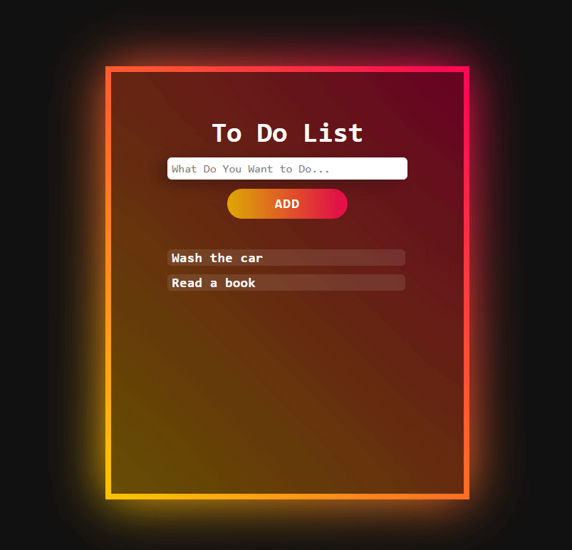

## Lista de Tarefas
Este é um pequeno projeto colocando em prática conceitos básicos de:

- JS
- CSS
- HTML

     

### Atualizações

Esse repositório contará com atualizações com objetivo de implementar mais funções a aplicação, buscando também aprimorar princípios **S.O.L.I.D** e conceitos de **Clean Code**.

Tecnologias a serem implementadas no projeto:
- Redux ✔️
- React 🚧

